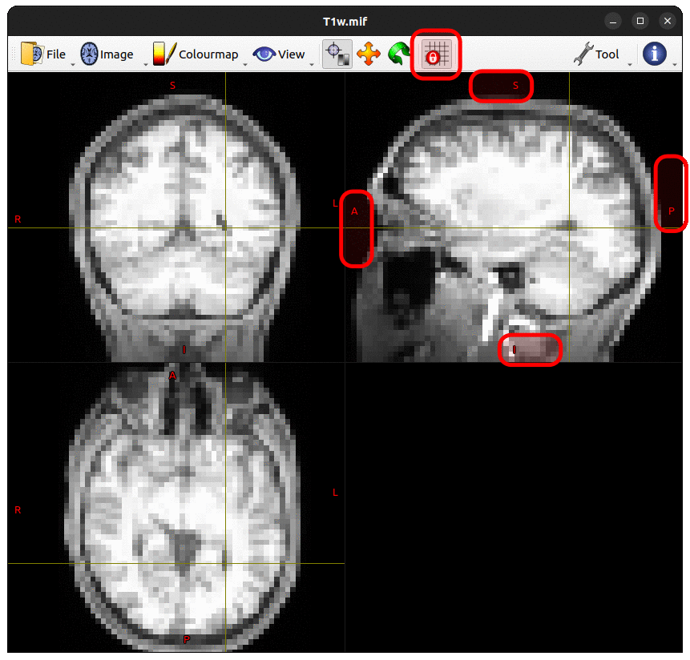

.. _mrview_lock_to_axes:

``mrview``'s "Lock To Image Axes"
=================================

In the GUI command ``mrview``,
there is a particular functionality regarding alignment between viewport camera and main image,
which under default behaviour can mislead users if not properly understood.
The aim of this documentation page is to demonstrate how this works under default and alternate behaviour,
explain why it is designed in the way that it is,
and demonstrate the preferable visualisation approach to use when assessing alignment between images.

The "main image"
----------------

While the ``mrview`` command can be executed with one or more input images specified at the command-line,
and/or one or more images can be opened from within the GUI environment,
only one of this set of images is ever displayed at any one time.
Here, that solitary image being displayed is referred to as the "*main image*",
distinguishing it from other image data that may be being displayed through the use of toolbars.

Evaluating image alignment
--------------------------

The specific confusion here relates to attempts to evaluate the alignment between two images
by switching the main image back and forth between them.
This is demonstrated here evaluating differences between a T1-weighted image
and a mean *b* = 0 image as computed from a pre-processed DWI series.
Both of these images have been grossly downsampled
in order to better highlight the alignments of their respective voxel grids.

Default: Lock To Image Axes *on*
^^^^^^^^^^^^^^^^^^^^^^^^^^^^^^^^

In this first example,
``mrview`` is shown switching back and forth between these two images.
The focus point
(faint horizontal & vertical yellow lines)
has been placed at the posterior edge of the left ventricle.
By switching between the two images,
it seems as though there may be a gross misalignment between them.
In the sagittal plane, there appears to be an erroneous rotation between the two images;
in the axial plane, the frontal lobe is present in the DWI but absent in the T1-weighted image.

Based on this visualiation,
one may be prone to conclude that these two images have not been appropriately coregistered.

Such would however be an *erroneous inference* in this case.

What's actually happening here is as follows.
When a main image is loaded into ``mrview``,
it wants to be able to display a single 2D slice of image data
with the two in-place image axes corresponding to the horizontal and vertical directions on the screen
(among other things, this makes initial execution of ``mrview`` very fast,
as it does not need to load the entire input image into memory,
just a single slice of it).
It therefore calculates the appropriate orientation of a virtual camera in three-dimensional space
that satisfies this criterion.
A single two-dimensional slice is therefore displayed,
but it is nevertheless *appropriately located* within three-dimensional space.

Now consider what happens when ``mrview`` switches from one main image to another.
It still wants to be able to load data for, and display,
just a single two-dimensional slice of image data.
It therefore, by default,
*realigns* the camera in order to conform to the voxel grid of the *new* main image.
This is in no way guaranteed to be aligned with the previous main image.

Here is the same two images as before,
switching from one to the other as the ``mrview`` main image,
highlighting the GUI control corresponding to this axis-locking functionality,
and with the crucial "orientation labels" visual aides shown and highlighted:

With the orientations in scanner space shown,
it becomes very clear that switching ``mrview`` between these two main images
is not a faithful way to assess the alignment of two images that are defined on different voxel grids.
Notably though, the biological structure underlying the focus point,
originally placed at the posterior edge of the left ventricle,
does appear to be consistent between the two images.
This occurs for two reasons:

1.  When ``mrview`` performs the calculations to realign the camera with the new main image,
    it does so in such a way that preserves the location of the focus point.
    
2.  These two images *are* actually well aligned in "real" / "scanner" space.
    The focus point is technically placed not on a specific voxel of a specific image,
    but in a three-dimensional coordinate in real space.
    As long as that location in real space samples image data that corresponds to the same anatomy,
    the images are considered to be well aligned with one another,
    even if those image data are stored on completely different voxel grids.

Opposite: Lock To Image Axes *off*
^^^^^^^^^^^^^^^^^^^^^^^^^^^^^^^^^^

It is possible to manually override this behaviour,
and instruct ``mrview`` to *not* lock the camera to the axes of the main image.
This however has other consequences for visualisation.
The animations below show the location of this control,
and what the window looks like when switching between the two images.

-   Unlike the previous example with Lock To Image Axes turned on,
    there now appears to be good alignment between these two images.
    This will be the case not only for visualisation,
    but also for any computations that interpret these image data with respect to their real space positions.

-   Notably in these animations,
    the orientation indicators *do not move* as the viewer switches from one image to the other.
    This is the primary consequence of disabling the "lock to image axes" functionality.
    
-   Because in this case the camera position was initially set based on the T1w image,
    there is still correspondence between the within-place axes of that image and the horizontal & vertical directions on the screen.
    For the DWI mean *b* = 0 image however,
    the axis orientations do *not* correspond to the vertical and horizontal screen directions,
    and therefore the image pixels do not appear as aligned squares,
    but are rather rotated on the screen.
    
-   In addition to the tilted pixels,
    there are also "shear lines" visible in the mean *b* = 0 image.
    This is because the misalignment between camera position and image axes occurs
    not only for the two image axes closest to the screen horizontal & vertical directions,
    but also for the third image axis closest to the through-screen direction.
    What is shown on the screen is effectively a two-dimensional slice through three-dimensional image data;
    as the depth of that slice cuts from one image slice to the next,
    the pixel intensities displayed within that slice switch from sampling data from one slice to the next,
    producing these shear lines.
    
The visual manifestations of misalignment between image axes and camera axes
can be mitigated by activating image interpolation for the ``mrview`` main image.
In this case, the T1-weighted and mean *b* = 0 image have comparable appearances on the screen,
despite the fact that the camera position is aligned to one but not the other
(though the angulation of the visible outer edge of the mean *b* = 0 image FoV gives a strong clue).

It is important to note however,
this is *not* simply producing a two-dimensional image slice to be presented on the screen
and then performing bilinear interpolation on that image to smooth its edges.
What is actually happening here is a *three-dimensional interpolation*:
the camera position defines an arbitrary two-dimensional place through three-dimensional space,
and for each displayed pixel within that plane,
trilinear interpolation is performed to produce an intensity from the underlying image data.

This caveat also highlights one of the reasons why the Lock To Image Axes feature is on by default.
By guaranteeing that the data of the main image being displayed is precisely one two-dimensional slice of data,
only the data corresponding to that one slice needs to be loaded into memory.
Where this feature is disabled,
it is necessary to immediately load data for the entire three-dimensional volume into GPU memory,
as an arbitrary camera plane could require sampling of data from any location within that three-dimensional volume.
Some users may have experienced a noticeable pause in command responsiveness
when initially making use of the ability to rotate the camera;
this is because performing a camera rotation by necessity disables the Lock To Image Axes button,
and therefore upon that first initial rotation the entire three-dimensional volume must be loaded into memory.

Alternative: Using the Overlay tool
^^^^^^^^^^^^^^^^^^^^^^^^^^^^^^^^^^^

As demonstrated above,
evaluating the relative alignment of two images by switching between them is prone to being misled.
An arguably more robust technique for performing such evaluation is to make use of ``mrview``'s Overlay Tool.
In the example below,
The T1-weighted image has been preserved as the ``mrview`` main image,
but had its colour map switched from "gray" to "cool".
The mean *b* = 0 image has then been loaded into the Overlay tool,
had the "hot" colour map applied,
and its opacity set to approximately 50%.
This means that both images are visible simultaneously throughout the entire viewing plane.
Using this mechanism it is clear that there is good alignment between image data from the two modalities.

