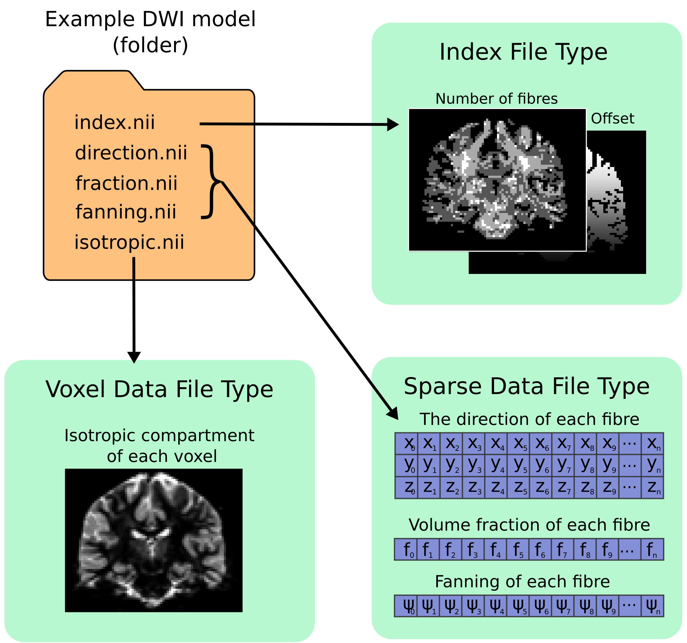

.. _mrtrix_sparse_format:
.. _fixel_format:

Fixel image (directory) format
------------------------------

Images for representing discrete multi-fibre models are sparse in nature (i.e. different voxels may have different numbers of
fibre populations - a.k.a "*fixels*", as described in the :ref:`fixels_dixels` page), and different models have different parameter requirements per fixel (e.g. orientation,
volume fraction, fanning, tensors etc). This fixel image format overcomes several issues in storing
such data in either traditional 4D images or a custom format (such as the legacy :ref:`legacy_mrtrix_sparse_format`).

Requirements
''''''''''''

This new format has been designed with the following requirements in mind:

* **Space saving**. Because different voxels may have different numbers of fixels, it is inefficient to store data using 4-dimensional images, since the size of the 4th dimension must accommodate the voxel with the highest number of fixels. A sparse representation on disk is therefore more efficient.
* **Easily read and written** by other software packages to enable inter-operability of fixel-based DWI models.
* **Flexible** enough to allow for both fixel-specific model parameters (e.g. volume fractions, fanning), and voxel-specific parameters (e.g. hindered isotropic compartment). The format should also support any number of model parameters.
* **Self-documenting**. Users should be able to easily infer what kind of data is included in the model. Developers should also easily understand the data layout, without having to read in special fields in the image header.
* **Minimise the need for supporting commands**. We wanted to avoid the need to have dedicated commands for performing basic operations on the data (e.g. math/calculator operations, thresholding, histogram generation etc).
* **Extendability**. Users should be able to add components to an existing sparse image. E.g. a mask to label fixels of interest, or additional test-statistic output from a group analysis.

Specifications
''''''''''''''
In the fixel format we have opted to leverage the file system by storing data belonging to a single sparse DWI model inside a single *directory/folder*
(in contrast to the old :ref:`legacy_mrtrix_sparse_format` where all data is stored inside a single *file*). Effectively the directory becomes the ‘dataset’. While this
implies that all data files must be kept together inside the directory, and can be tampered with (or accidently deleted) by users, we believe
the transparency and accessibility of the data is beneficial and enables all of the above requirements to be met.

All files types saved inside the format are in either `NIfTI-2 format <_nifti_format>`__ (for maximum compatibility with other packages) or :ref:`mrtrix_image_formats`. To help describe the format and the layout of the files within the directory, we have used an example of how a ball and racket-like model may be stored:

Fixel format file types
'''''''''''''''''''''''

Index File
...............
-  4D image (i x j x k x 2).
-  The index file is required, with fixed naming (``index.nii`` or ``index.mif``).
-  The first 3D volume in the 4th dimension stores the *number of elements (fixels)* per voxel.
-  The second volume in the 4th dimension stores the *index of the first element (fixel)* in that voxel; indices for the subsequent elements in each voxel are inferred to be sequential.

Fixel Data File
.................
-  3D image (n x p x 1) where n is the total number of elements in the image, and p is the number of parameters per element (e.g. 3 for direction.nii, 1 for volume.nii, or 6 for a multi-tensor model).
-  For each voxel, data for the elements within that voxel must be stored within sequential indices in the first dimension.
-  Easily identified as a data file type because the size of the image is 1 in the 3rd dimension
-  Any number of Fixel Data File types may be present in the directory. In the example image above, the volume fraction and fanning angle parameters have been saved as separate files; however the format is flexible and allows for multiple parameters, p, per element.
-  Any naming convention can be used for Fixel Data Files, with the exception of:
   - The directions file (see below).
   - If a particular set of commands expect to write and subsequently read one or more data files with a fixed name, then manually renaming such files may prevent the operation of that set of commands.

.. NOTE::
  The number of fixels in a whole-brain image can be very large (> 100,000).
  The NIfTI-1 format therefore cannot be used in this context, as it
  restricts the total number of voxels along any dimension of the image to
  65,535. This is why either `NIfTI-2 <_nifti_format>`__ or
  :ref:`mrtrix_image_formats` must be used.

Fixel Direction File
......................
* **All fixel-based DWI models must specify the direction of each fixel**.
* Directions for each fixel must be saved within a single file named either ``directions.nii`` or ``directions.mif``.
* This can be considered as a special type of fixel data file, with dimensions (n x 3 x 1).
* Directions must be specified with respect to the *scanner coordinate frame*, in *cartesian coordinates*.

Voxel Data File
................
* 3D or 4D image
* Any number of Voxel Data Files may be stored in the directory
* Must have the same resolution and header transform as the index image
* Naming of files is flexible
* The 4th dimension is optional, but allows for multiple parameters per voxel to be stored (e.g. 6 tensor coefficients of the ‘hindered’ compartment in CHARMED)

Usage
''''''''''
Because the fixel format leverages the file system to store all fixel data within a single directory,
interacting with fixel data in *MRtrix3* may require user input and output arguments to be either:
1) the path to the fixel format directory; or 2) specific fixel data files within the directory. For
example, :code:`fod2fixel` requires the name of the containing directory *and* the names of the output
fixel data files to be stored inside the directory::

  fod2fixel patient01/fod.mif patient01/fixel_directory -afd afd.mif -disp dispersion.mif

In this example, a new fixel format directory is created, with the name ``patient01_fixel_directory``;
this includes creation of the requisite index and directions files. Fixel Data Files for two
fixel-specific measures (AFD and dispersion) are then additionaly saved inside this directory.

Other commands, such as :code:`fixel2voxel`, may only require the fixel data file::

  fixel2voxel patient01/fixel_directory/afd.mif sum patient01/total_afd.mif

A major benefit of the directory-based format is that existing commands for operating on traditional images can be used to manipulate fixel data. For example, to threshold fixels based on their AFD value::

  mrthreshold patient01/fixel_directory/afd.mif -abs 0.1 patient01/fixel_directory/afd_mask.mif

Other commands like ``mrhistogram``, ``mrcalc`` and ``mrstats`` can also be used on Fixel Data Files. For example, to compute the mean dispersion over all fixels in a mask::

  mrstats -output mean -mask patient01/fixel_directory/afd_mask.mif patient01/fixel_directory/dispersion.mif

Viewing fixel data in mrview
''''''''''''''''''''''''''''
Fixel data can be visualised using the "Fixel Plot" tool in ``mrview``. Any
image within the fixel directory can be opened by the file chooser. By
default the fixels will be coloured based on the file selected when loaded
(e.g. if you select the fixel directions file, fixels will be colour-coded by
direction; if ``afd.mif`` is selected they will be coloured by AFD value).
Irrespective of the file selected to view the fixel file, all other fixel
file types in the fixel directory will be detected and available for use in
colour-coding and thresholding fixels via a combo box in the Fixel Plot tool.
This enables advanced visualisations such as thresholding fixels by p-value
while colour-coding by effect size.
