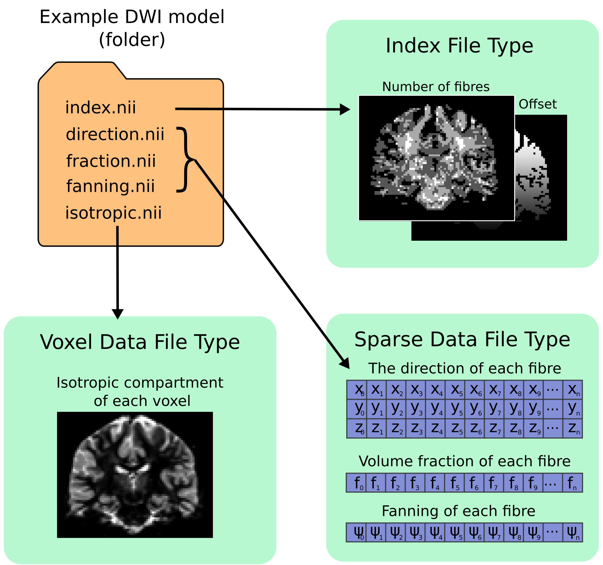

.. _image_handling:

Images and other data
=====================

Image format handling in *MRtrix3*
----------------------------------

*MRtrix3* provides a flexible data input/output back-end in the shared
library, which is used across all applications. This means that all
applications in *MRtrix3* can read or write images in all the supported
formats - there is no need to explicitly convert the data to a given
format prior to processing.

However, some specialised applications may expect additional information
to be present in the input image. The MRtrix .mif/.mih formats are both
capable of storing such additional information data in their header, and
will hence always be supported for such applications. Most image formats
however cannot carry additional information in their header (or at
least, not easily) - this is in fact one of the main motivations for the
development of the MRtrix image formats. In such cases, it would be
necessary to use MRtrix format images. Alternatively, it may be
necessary to provide the additional information using command-line
arguments (this is the case particularly for the DW gradient table, when
providing DWI data in NIfTI format for instance).

Image file formats are recognised by their file extension. One exception
to this is DICOM: if the filename corresponds to a folder, it is assumed
to contain DICOM data, and the entire folder will be scanned recursively
for DICOM images.

It is also important to note that the name given as an argument will not
necessarily correspond to an actual file name on disk: in many cases,
images may be split over several files. What matters is that the text
string provided as the *image specifier* is sufficient to unambiguously
identify the full image.

.. _image_coord_system:

Coordinate system
'''''''''''''''''

All *MRtrix3* applications will consistently use the same coordinate
system, which is identical to the
`NIfTI <http://nifti.nimh.nih.gov/nifti-1>`__ standard. Note that this
frame of reference differs from the `DICOM
standard <https://www.dabsoft.ch/dicom/3/C.7.6.2.1.1/>`__ (typically the
x & y axis are reversed). The convention followed by *MRtrix3* applications
is as follows:

+---------------+-----------------------------------------+
| dimensional   | description                             |
+===============+=========================================+
| 0 (x)         | increasing from left to right           |
+---------------+-----------------------------------------+
| 1 (y)         | increasing from posterior to anterior   |
+---------------+-----------------------------------------+
| 2 (z)         | increasing from inferior to superior    |
+---------------+-----------------------------------------+

All coordinates or vector components supplied to *MRtrix3* applications
should be provided with reference to this coordinate system.

.. _multi_file_image_file_formats:

Multi-file numbered image support
'''''''''''''''''''''''''''''''''

It is possible to access a numbered series of images as a single
multi-dimensional dataset, using a syntax specific to MRtrix. For example::

    $ mrinfo MRI-volume-[].nii.gz

will collate all images that match the pattern
``MRI-volume-<number>.nii.gz``, sort them in ascending numerical order,
and access them as a single dataset with dimensionality one larger than
that contained in the images. In other words, assuming there are 10
``MRI-volume-0.nii.gz`` to ``MRI-volume-9.nii.gz``, and each volume is a
3D image, the result will be a 4D dataset with 10 volumes.

Note that this isn't limited to one level of numbering::

    $ mrconvert data-[]-[].nii combined.mif

will collate all images that match the ``data-number-number.nii``
pattern and generate a single dataset with dimensionality two larger
than its constituents.

Finally, it is also possible to explicitly request specific numbers,
using :ref:`number_sequences`
within the square brackets::

    $ mrconvert data-[10:20].nii combined.mif

.. _data_types:

Data types
''''''''''

*MRtrix3* applications can read and write data in any of the common data types.
Many *MRtrix3* commands also support the ``-datatype`` option to specify the
data type for the output image. For example::

    $ mrconvert DICOM_images/ -datatype float32 output.nii

.. NOTE::
  Not all image formats support all possible datatypes. The MRtrix image file
  formats are designed to handle all of the possibilities listed below, while
  other image formats may only support a subset. When a data type is requested
  that isn't supported by the image format, a hopefully suitable alternative
  data type will be used instead.

Below is a list of the supported data types and their specifiers for use
on the command-line. Note that *MRtrix* is not sensitive to the case of
the specifier: ``uint16le`` will work just as well as ``UInt16LE``.

+--------------+---------------------------------------------------------------+
| Specifier    | Description                                                   |
+==============+===============================================================+
| Bit          | bitwise data                                                  |
+--------------+---------------------------------------------------------------+
| Int8         | signed 8-bit (char) integer                                   |
+--------------+---------------------------------------------------------------+
| UInt8        | unsigned 8-bit (char) integer                                 |
+--------------+---------------------------------------------------------------+
| Int16        | signed 16-bit (short) integer (native endian-ness)            |
+--------------+---------------------------------------------------------------+
| UInt16       | unsigned 16-bit (short) integer (native endian-ness)          |
+--------------+---------------------------------------------------------------+
| Int16LE      | signed 16-bit (short) integer (little-endian)                 |
+--------------+---------------------------------------------------------------+
| UInt16LE     | unsigned 16-bit (short) integer (little-endian)               |
+--------------+---------------------------------------------------------------+
| Int16BE      | signed 16-bit (short) integer (big-endian)                    |
+--------------+---------------------------------------------------------------+
| UInt16BE     | unsigned 16-bit (short) integer (big-endian)                  |
+--------------+---------------------------------------------------------------+
| Int32        | signed 32-bit int (native endian-ness)                        |
+--------------+---------------------------------------------------------------+
| UInt32       | unsigned 32-bit int (native endian-ness)                      |
+--------------+---------------------------------------------------------------+
| Int32LE      | signed 32-bit int (little-endian)                             |
+--------------+---------------------------------------------------------------+
| UInt32LE     | unsigned 32-bit int (little-endian)                           |
+--------------+---------------------------------------------------------------+
| Int32BE      | signed 32-bit int (big-endian)                                |
+--------------+---------------------------------------------------------------+
| UInt32BE     | unsigned 32-bit int (big-endian)                              |
+--------------+---------------------------------------------------------------+
| Float32      | 32-bit floating-point (native endian-ness)                    |
+--------------+---------------------------------------------------------------+
| Float32LE    | 32-bit floating-point (little-endian)                         |
+--------------+---------------------------------------------------------------+
| Float32BE    | 32-bit floating-point (big-endian)                            |
+--------------+---------------------------------------------------------------+
| Float64      | 64-bit (double) floating-point (native endian-ness)           |
+--------------+---------------------------------------------------------------+
| Float64LE    | 64-bit (double) floating-point (little-endian)                |
+--------------+---------------------------------------------------------------+
| Float64BE    | 64-bit (double) floating-point (big-endian)                   |
+--------------+---------------------------------------------------------------+
| CFloat32     | complex 32-bit floating-point (native endian-ness)            |
+--------------+---------------------------------------------------------------+
| CFloat32LE   | complex 32-bit floating-point (little-endian)                 |
+--------------+---------------------------------------------------------------+
| CFloat32BE   | complex 32-bit floating-point (big-endian)                    |
+--------------+---------------------------------------------------------------+
| CFloat64     | complex 64-bit (double) floating-point (native endian-ness)   |
+--------------+---------------------------------------------------------------+
| CFloat64LE   | complex 64-bit (double) floating-point (little-endian)        |
+--------------+---------------------------------------------------------------+
| CFloat64BE   | complex 64-bit (double) floating-point (big-endian)           |
+--------------+---------------------------------------------------------------+

.. _transform:

The image transfom
''''''''''''''''''

The orientation of the image with respect to the scanner axes is determined by
the combination of the *image axes* and the *location of the corner voxel*. This
information is encapsulated in the *transformation matrix*, commonly referred
to simply as the *transform*. You can view the transform for any image using
:ref:`mrinfo`, for example::

    $ mrinfo dwi.mif
    ************************************************
    Image:               "dwi.mif"
    ************************************************
      Dimensions:        104 x 104 x 54 x 167
      Voxel size:        2.30769 x 2.30769 x 2.3 x ?
      Data strides:      [ -1 -2 3 4 ]
      Format:            MRtrix
      Data type:         unsigned 16 bit integer (little endian)
      Intensity scaling: offset = 0, multiplier = 1
      Transform:               0.9999   6.887e-09    -0.01564      -116.1
                            -0.001242      0.9968    -0.07943      -89.44
                              0.01559     0.07944      0.9967      -64.27
      comments:          TOURNIER DONALD (BRI) [MR] diff60_b3000_2.3_iPat2+ADC
                         study: BRI_Temp_backup Donald
                         DOB: 09/03/1977
                         DOS: 03/10/2007 15:58:40
      dw_scheme:         [ 167 entries ]

The 'Transform' field above shows the first 3 rows of the transformation matrix
(technically, this is a 4×4 matrix, but the last row is always set to ``[ 0 0 0
1 ]``). The first 3 columns correspond to the *x*, *y* & *z* image axes
respectively, while the last column corresponds to the location *in real
(scanner/world) space* of the corner voxel (i.e. the voxel at index ``[ 0 0 0 ]``).

In *MRtrix3*, the transform shown always corresponds to the transformation from
image coordinates *in millimeters* to scanner coordinates *in millimeters* -
the voxel size is not taken into account, and the image axes are always
normalised to unit amplitude. This may differ from other packages.

Furthermore, *MRtrix3* will always present the transform that best matches the
real space. If the transform of the image on file represents a large rotation,
such that for example the first image axis is closer to the scanner's *z*
axis, this transform will be modified by permutation or inversion of the axes
to bring it in alignment with the expected coordinate system, so that the first
axis genuinely can be interpreted as approximately left-right, etc. To achieve
this, *MRtrix3* will also modify the image :ref:`strides` to match.

.. _strides:

Strides
'''''''

A file is simply a linear array of values. Image data on the other hand are
multidimensional arrays. The image values can therefore be ordered on file
in many different ways. For example, we could start from the voxel at the left
posterior inferior corner of the image, and store intensity values in order of
traversal towards the *right*. Once the other end of the image is reached, we
repeat the process for the row of values *anterior* to the last one, and repeat
until the end of the slice. At this point, we store the slice *superior* to the
last one, until the whole image has been stored. This ordering scheme is
what is typically used in the NIfTI standard, and is commonly referred to as
RAS (right anterior posterior), referring to the direction of traversal of each
axis in turn. This scheme is also often referred to as *neurological*, although
this term is in general much more ambiguous.

However, this is only a convention, and many other combinations are possible.
For instance, it is possible to start from the *right* posterior inferior
corner, and raster through along the *left* direction, then store the next row
along the anterior direction, and finally the next slice in the superior
direction. This scheme is what is normally used in the now deprecated Analyse
format, and is commonly referred to as LAS or *radiological*.

Of course, there are many more possibilities. For instance, sagittal DICOM
images will typically be stored using a PIR (posterior inferior right) order,
since each sagittal slice is stored in order, etc. *MRtrix3* applications are
agnostic to the order of storage, and can handle any such images provided the
format is clear about what the order is.

In *MRtrix3*, the order of storage is defined by their *strides*. These refer
to the number of voxels between a given voxel and the next voxel along a given
dimension. For instance, in a 128×128×128 image stored using RAS ordering, the
strides would be ``1,128,16384``: the next voxel along the *x* axis is just one
voxel away, while the next voxel along the *y* axis is 128 values away (i.e. a
whole row of *x* values), and so on. In contrast, if stored in LAS order, the
strides would be ``-1,128,16384``, indicating that the next voxel along the *x*
axis would actually be stored one value *before* the current one.

To simplify the specification of these strides, *MRtrix3* typically expects and
provides *symbolic* strides. For example, the RAS strides above would be
expressed as ``1,2,3``, since this is sufficient to deduce the actual strides once
the image dimensions are known. Likewise, LAS would correspond to strides of
``-1,2,3``, PIR to ``3,-1,-2``, etc. This has the advantage that the
specification of the strides is then independent of the image dimensions.

Using strides to specify ordering also allows the specification to
generalise to arbitrary dimensions. For example, it is fairly common for
*MRtrix3* applications to request their output for 4D images to be written with
strides ``2,3,4,1`` (if the image format supports it): this corresponds to a
volume-contiguous order, whereby the values for all volumes of a given voxel
are written next to each other on file; this often has performance advantages
for applications that need to process all values for a given voxel
concurrently (as is often the case in diffusion MRI), by allowing the hardware
to make better use of resources (tractography is one such example).

Many *MRtrix3* commands accept the ``-stride`` option, which is used to specify
the strides for the output image. For example, to generate a LAS (radiological)
NIfTI image for use with FSL (along with the corresponding bvecs/bvals), you
can use :ref:`mrconvert` along with the ``-stride -1,2,3,4`` option::

    $ mrconvert dwi.mif -stride -1,2,3,4 -export_grad_fsl bvecs bvals dwi.nii

Likewise, if you need to ensure the orientation is neurological (RAS), you can
specify strides ``1,2,3,4`` (or use the ``1:4`` shorthand). You can also specify
other combinations if required: for example ``-stride -2,-1,3,4`` would
correspond to a PLS coordinate system, ``-stride 2,3,4,1`` would correspond to
volume-contiguous storage (with RAS for the spatial axes), etc.

The different formats supported by *MRtrix3* differ in the range of strides
that they support. The :ref:`mrtrix_image_formats` are the only formats to
support arbitrary combinations.

.. NOTE::
  Not all image formats support all possible datatypes. The
  :ref:`mrtrix_image_formats` are designed to handle arbitrary strides, while
  other image formats may only support a limited subset.  When strides are
  requested that are not supported by the image format, a hopefully suitable
  alternative will be used instead.

Interaction between strides and transform
.........................................

There is an interaction between the strides and the image transform: if the
transform matrix corresponds to a 90° rotation, this can be viewed as changing
the *strides* without affecting the transform. Such a large rotation has
changed the order of storage relative to the anatomical labels typically used
to refer to the ordering (e.g. RAS, LAS, etc).  For example, if a RAS image is
modified such that its transform rotates the image axes by 90° around the *y*
axis, this in effect implies that voxels are now ordered IAR (i.e.
*right* becomes *inferior*, *anterior* remains as-is, and *superior* becomes
*right*).

The *MRtrix3* back-end will indeed interpret such large rotations as affecting
the strides, so that if the strides are stated as ``1,2,3``, the order of
storage will always be left->right, posterior->anterior, inferior->superior
*relative to the scanner axes*. Note that this also implies that the transform
matrix will always be modified as necessary to bring it close to the standard
coordinate system, so that the first image axis is close to the *x* axis, etc.
This allows *MRtrix3* applications to operate on images in the knowledge that
these axes are always anatomically as expected, without worrying about the
details of *how* this information was actually stored on file.

It is important to bear this in mind when interpreting for output of
:ref:`mrinfo` for example, since this produces the strides and transform *as
interpreted by MRtrix3*, rather than those actually stored on file - although
the two representations should be strictly equivalent. If you need to inspect
the information as stored on file, use :ref:`mrinfo`'s ``-norealign`` option.

.. _supported_image_formats:

Supported image formats
-----------------------

This lists the various image formats currently supported by *MRtrix3*.

.. _mrtrix_image_formats:

MRtrix image formats (``.mih / .mif``)
''''''''''''''''''''''''''''''''''''''

These MRtrix-specific image formats are closely related. They consist of
a text header, with data stored in binary format, either within the same
file (.mif) or as one or more separate files (.mih). In both cases, the
header structure is the same, as detailed below. These file formats were
devised to address a number of limitations inherent in currently
available formats. In particular:

-  simplicity: as detailed below, the header format is deliberately kept
   very simple and human-readable, making it easy to debug and edit
   manually if needed.
-  extendability: any information can be stored in the header, and will
   simply be ignored by the application if not recognised.
-  arbitrary data organisation: voxel values can be stored in any order,
   making it simple to ensure for example that all FOD coefficients for
   a given voxel are stored contiguously on file.

Note that *MRtrix3* now includes *MatLab* functions to read and write MRtrix
image files, and to load MRtrix tracks files. These are located in the
``matlab`` subfolder.

Compressed MRtrix image format (``.mif.gz``)
............................................

*MRtrix3* also supports the compressed version of the single-file ``.mif``
format, both for reading and writing.

.. NOTE::
  While this can reduce file sizes, it does incur a runtime cost when reading or
  writing the image (a process that can often take longer than the operation to
  be performed), and will require the entire image to be loaded uncompressed into
  RAM (*MRtrix3* can otherwise make use of
  `memory-mapping <https://en.wikipedia.org/wiki/Memory-mapped_file>`__ to keep RAM
  requirements to a minimum). For large files, these costs can become
  considerable; you may find that *MRtrix3* can process a large uncompressed
  image, yet run out of RAM when presented with the equivalent compressed
  version (in such cases, you can try using ``gunzip`` to uncompress the file
  manually before invoking the relevant *MRtrix3* command).

Header structure
................

The header is the first (and possibly only) data stored in the file, as
ASCII-encoded text (although other encodings such as UTF8 may work
equally well). Lines should be separated by Unix-style newlines
(line-feed, '', ASCII 0x0A), although MRtrix will also accept DOS-type
newlines.

The first line should read only ``mrtrix image`` to indicate that this
is an image in MRtrix format. The last line of the header should read
only ``END`` to signal the end of the header, after which all data will
be considered as binary.

All lines *between* these two entries must be represented as key-value
pairs, as described below.

.. _header_keyvalue_pairs:

Header key-value pairs
......................

All following lines are in the format ``key: value``, with the value
entry extending up to the end of the line. All whitespace characters
before and after the value entry are ignored. Some keys are required to
read the images, others are optional (sensible defaults will be
substituted if they are absent). Recognised keys are provided in the
list below, along with the expected format of the corresponding values.

-  **dim** [required]

   the image dimensions, supplied as a comma-separated list of integers.
   The number of entries specifies the dimensionality of the image. For
   example: ``dim: 192,256,256`` specifies a 192×256×256 image.

-  **vox** [required]

   the voxel size along each dimension, as a comma-separated list of
   floating-point values. The number of entries should match that given
   in the dim entry. For example: ``vox: 0.9,0.898438,0.898438``.

-  **layout** [required]

   specifies the organisation of the data on file. In simplest terms, it
   provides a way of specifying the strides required to navigate the
   data file, in combination with the dim entry. It is given as a
   comma-separated list of signed integers, with the sign providing the
   direction of data traversal with respect to voxel coordinates, and
   the value providing a way of specifying the order of increasing
   stride.

   For example, assuming an image with ``dim: 192,256,256``, the entry
   ``layout: +2,-0,-1`` is interpreted as: the shortest stride is along
   the y-axis (second entry), then the z-axis (third entry), and then
   along the x-axis. Voxels are stored in the order left to right
   (positive stride) along the x-axis; anterior to posterior along the
   y-axis (negative stride); and superior to inferior (negative stride)
   along the z-axis. Given the image dimensions, the final strides are
   therefore 256×256=65536 for adjacent voxels along the x-axis, -1 for
   the y-axis, and -256 for the z-axis. This also implies that the voxel
   at coordinate [ 0 0 0 ] is located 65536 voxel values into the data
   portion of the file.

-  **datatype** [required]

   the datatype used to store individual voxel values. See the listing of
   valid :ref:`data_types`. For example: ``datatype: UInt16LE``

-  **file** [required]

   specifies where the binary image data are stored, in the format file:
   filename offset, with the offset provided in bytes from the beginning
   of the file. For example: ``file: image.dat 0``.

   For the single-file format (.mif), the filename should consists of a
   single full-stop ('.') to indicate the current file, and the offset
   should correspond to a point in the file after the END statement of
   the header.

   For the separate header/data format (.mih), the filename should refer
   to an existing file in the same folder as the header (.mih) file.
   Multiple such entries can be supplied if the data are stored across
   several files.

-  **transform** [optional]

   used to supply the 4×4 transformation matrix specifying the
   orientation of the axes with respect to real space. This is supplied
   as a comma-separated list of floating-point values, and only the
   first 12 such values will be used to fill the first 3 rows of the
   transform matrix. Multiple such entries can be provided to fill the
   matrix; for example, *MRtrix3* will normally produce 3 lines for the
   transform, with one row of 4 values per entry::

       transform: 0.997986,-0.0541156,-0.033109,-74.0329
       transform: 0.0540858,0.998535,-0.00179436,-100.645
       transform: 0.0331575,2.34007e-08,0.99945,-125.84

-  **scaling** [optional]

   used to specify how intensity values should be scaled, provided as an
   offset and scale. Voxel values will be read as value\_returned =
   offset + scale \* value\_read. For example: ``scaling: -1,2``.
   Default is ``0,1`` (no modification).

In addition to these keys, it is also possible to store additional
key-value pairs within the header of these image files. If a particular
key is not recognised by *MRtrix3*, it is simply ignored (but may be
carried over to any outputs resulting from the command, depending on the
particular command).

There are some keys that are utilized by particular *MRtrix3* commands
in order to preserve important information as image data are passed
between commands. A prominent example is ``dw_scheme``, which is used
to embed the diffusion gradient table within the :ref:`embedded_dw_scheme`.

.. _dicom_format:

DICOM (folder or ``.dcm``)
''''''''''''''''''''''''''

DICOM format is only supported for reading. *MRtrix3* applications will assume
an image is in DICOM format if the image specifier provided corresponds to a
folder or ends with the ``.dcm`` extension. For a folder, the application will
scan the entire folder and its subfolders for DICOM files and generate a list
of DICOM patients, studies and series. If a single series is found within the
folder, this data set will be accessed with no further interaction required.
Otherwise, the user will be prompted to select the series of interest.
*MRtrix3* supports data from all major manufacturers, including Siemens mosaics
and the newer single-file multi-frame format.

A separate application, :ref:`dcminfo`, is provided to view all DICOM header
elements within a particular DICOM file, including Siemens' custom shadow
attributes (CSA).

Note that no support is provided for reading the ``DICOMDIR`` entry due to
case-sensitivity issues. DICOM data are typically stored on CD or DVD on a
case-insensitive filesystem. However, Unix systems will typically not access
these filesystems in a case-insensitive manner, and will fail to find the
appropriate files if the case of filenames supplied in the DICOMDIR file does
not match the case of the files found on the CD or DVD.

.. _nifti_format:

NIfTI & NIfTI-2 (``.nii``)
''''''''''''''''''''''''''

These file formats are supported both for reading and writing, and allows
interoperation with other packages such as `SPM <http://www.fil.ion.ucl.ac.uk/spm/>`__
or `FSL <http://fsl.fmrib.ox.ac.uk/fsl/>`__. The ``mrinfo`` command can be
used to determine whether a particular image is in NIfTI-1 or NIfTI-2 format.

.. NOTE::

  if both qform and sform orientation fields are present, the qform fields are
  ignored. Obviously, the qform fields will be used if they are present on
  their own.

.. _compressed_nifti_format:

Compressed NIfTI (``.nii.gz``)
..............................

*MRtrix3* also supports compressed NIfTI images (both versions 1 & 2), for both
reading and writing.

.. NOTE::
  While this can reduce file sizes, it does incur a runtime cost when reading or
  writing the image (a process that can often take longer than the operation to
  be performed), and will require the entire image to be loaded uncompressed into
  RAM (*MRtrix3* can otherwise make use of
  `memory-mapping <https://en.wikipedia.org/wiki/Memory-mapped_file>`__ to keep RAM
  requirements to a minimum). For large files, these costs can become
  considerable; you may find that *MRtrix3* can process a large uncompressed
  image, yet run out of RAM when presented with the equivalent compressed
  version (in such cases, you can try using ``gunzip`` to uncompress the file
  manually before invoking the relevant *MRtrix3* command).

.. _mgh_formats:

FreeSurfer formats (``.mgh / .mgz``)
''''''''''''''''''''''''''''''''''''

*MRtrix3* supports both of these formats for reading and writing.

Images stored in these formats may include
`additional data structures <https://surfer.nmr.mgh.harvard.edu/fswiki/FsTutorial/MghFormat>`__
that follow the image data. These data structures provide a similar functionality
to the :ref:`header_keyvalue_pairs` used in the :ref:`_mrtrix_image_formats`.

When present in an input file, _MRtrix3_ will import these data into
:ref:`header_keyvalue_pairs`, with keys named "``MGH_*``" (each element present
in the input file is named and stored individually), and the values for these
data structures will be written in legible format (e.g. matrix data are stored as
delimited text). The data will therefore be encapsulated within the image header
and preserved (as long as formats capable of retaining this information are used
subsequently). For instance::

    $ mrinfo image.mgz
    ************************************************
    Image:               "image.mgz"
    ************************************************
      Dimensions:        256 x 256 x 256
      Voxel size:        1 x 1 x 1
      Data strides:      [ -1 3 -2 ]
      Format:            MGZ (compressed MGH)
      Data type:         unsigned 8 bit integer
      Intensity scaling: offset = 0, multiplier = 1
      Transform:                    1  -4.098e-08   6.147e-08      -129.3
                           -8.196e-08           1   7.189e-09      -118.1
                            4.377e-08  -2.133e-08           1      -147.7
      MGH_TAG_AUTO_ALIGN: 0.998104,0.054096,-0.029327,2.066329
                         -0.061351,0.912803,-0.403062,-27.35524
                         0.004969,0.404097,0.914391,-5.738687
                         0,0,0,1
      MGH_TAG_MRI_FRAME: 0,0,0,0,0,0,0,0,0,0,0,0,0,0,0,0,0,0,0,,0,0 0 0 0 0 0 0 0 0 0 0 0 0 0 0 0,0,0
      MGH_TAG_PEDIR:     UNKNOWN
      MGH_TE:            1.91
      MGH_TI:            1100
      MGH_TR:            2300
      MGH_flip:          7

Whenever _MRtrix3_ writes an image to one of these formats, it will check the
:ref:`header_keyvalue_pairs` for any such data that may have been created by
_MRtrix3_ when importing such an image earlier. Any such data found will be
correspondingly written to the data structures following the image data,
formatted such that FreeSurfer tools are capable of reading them. Other header
key-value entries that do not begin with "``MGH_*``", and of which FreeSurfer
is not aware, will _not_ be written to this section of any output ``.mgh`` /
``.mgz`` image files.

.. _analyze_format:

Analyse format (``.img / .hdr``)
''''''''''''''''''''''''''''''''

This file format is supported both for reading and writing. However, when
writing, the newer NIfTI standard will be used, since the Analyse format cannot
store crucial information such as the image transform, and is hence deprecated.
If these images are actually stored as NIfTI, they will be handled
appropriately according to the standard.

.. NOTE::
  In order to specify an Analyse format image on the command line, type the name
  of its *data* file (``*.img``), *not* the header file.

.. WARNING::
  By default, Analyse format images will be assumed to be stored using RAS
  (radiological) convention. This can modified in the :ref:`mrtrix_config`, by
  setting the ``Analyse.LeftToRight`` entry to ``true``.

.. _mrtrix_sparse_format:
.. _fixel_format:

Fixel image (directory) format
------------------------------

Images for representing discrete multi-fibre models are sparse in nature (i.e. different voxels may have different numbers of
fibre populations - a.k.a *`fixels <fixels_dixels>`__*), and different models have different parameter requirements per fixel (e.g. orientation,
volume fraction, fanning, tensors etc). This fixel image format overcomes several issues in storing
such data in either traditional 4D images or a custom format (such as the legacy :ref:`legacy_mrtrix_sparse_format`).

Requirements
''''''''''''

This new format has been designed with the following requirements in mind:

* **Space saving**. Because different voxels may have different numbers of fixels, it is inefficient to store data using 4-dimensional images, since the size of the 4th dimension must accommodate the voxel with the highest number of fixels. A sparse representation on disk is therefore more efficient.
* **Easily read and written** by other software packages to enable inter-operability of fixel-based DWI models.
* **Flexible** enough to allow for both fixel-specific model parameters (e.g. volume fractions, fanning), and voxel-specific parameters (e.g. hindered isotropic compartment). The format should also support any number of model parameters.
* **Self-documenting**. Users should be able to easily infer what kind of data is included in the model. Developers should also easily understand the data layout, without having to read in special fields in the image header.
* **Minimise the need for supporting commands**. We wanted to avoid the need to have dedicated commands for performing basic operations on the data (e.g. math/calculator operations, thresholding, histogram generation etc).
* **Extendability**. Users should be able to add components to an existing sparse image. E.g. a mask to label fixels of interest, or additional test-statistic output from a group analysis.

Specifications
''''''''''''''
In the fixel format we have opted to leverage the file system by storing data belonging to a single sparse DWI model inside a single *directory/folder*
(in contrast to the old :ref:`legacy_mrtrix_sparse_format` where all data is stored inside a single *file*). Effectively the directory becomes the ‘dataset’. While this
implies that all data files must be kept together inside the directory, and can be tampered with (or accidently deleted) by users, we believe
the transparency and accessibility of the data is beneficial and enables all of the above requirements to be met.

All files types saved inside the format are in either `NIfTI-2 format <_nifti_format>`__ (for maximum compatibility with other packages) or :ref:`mrtrix_image_formats`. To help describe the format and the layout of the files within the directory, we have used an example of how a ball and racket-like model may be stored:

Fixel format file types
'''''''''''''''''''''''

Index File
...............
-  4D image (i x j x k x 2).
-  The index file is required, with fixed naming (``index.nii`` or ``index.mif``).
-  The first 3D volume in the 4th dimension stores the *number of elements (fixels)* per voxel.
-  The second volume in the 4th dimension stores the *index of the first element (fixel)* in that voxel; indices for the subsequent elements in each voxel are inferred to be sequential.

Fixel Data File
.................
-  3D image (n x p x 1) where n is the total number of elements in the image, and p is the number of parameters per element (e.g. 3 for direction.nii, 1 for volume.nii, or 6 for a multi-tensor model).
-  For each voxel, data for the elements within that voxel must be stored within sequential indices in the first dimension.
-  Easily identified as a data file type because the size of the image is 1 in the 3rd dimension
-  Any number of Fixel Data File types may be present in the directory. In the example image above, the volume fraction and fanning angle parameters have been saved as separate files; however the format is flexible and allows for multiple parameters, p, per element.
-  Any naming convention can be used for Fixel Data Files, with the exception of:
   - The directions file (see below).
   - If a particular set of commands expect to write and subsequently read one or more data files with a fixed name, then manually renaming such files may prevent the operation of that set of commands.

.. NOTE::
  The number of fixels in a whole-brain image can be very large (> 100,000).
  The NIfTI-1 format therefore cannot be used in this context, as it
  restricts the total number of voxels along any dimension of the image to
  65,535. This is why either `NIfTI-2 <_nifti_format>`__ or
  :ref:`mrtrix_image_formats` must be used.

Fixel Direction File
......................
* **All fixel-based DWI models must specify the direction of each fixel**.
* Directions for each fixel must be saved within a single file named either ``directions.nii`` or ``directions.mif``.
* This can be considered as a special type of fixel data file, with dimensions (n x 3 x 1).
* Directions must be specified with respect to the *scanner coordinate frame*, in *cartesian coordinates*.

Voxel Data File
................
* 3D or 4D image
* Any number of Voxel Data Files may be stored in the directory
* Must have the same resolution and header transform as the index image
* Naming of files is flexible
* The 4th dimension is optional, but allows for multiple parameters per voxel to be stored (e.g. 6 tensor coefficients of the ‘hindered’ compartment in CHARMED)

Usage
''''''''''
Because the fixel format leverages the file system to store all fixel data within a single directory,
interacting with fixel data in *MRtrix3* may require user input and output arguments to be either:
1) the path to the fixel format directory; or 2) specific fixel data files within the directory. For
example, :code:`fod2fixel` requires the name of the containing directory *and* the names of the output
fixel data files to be stored inside the directory::

  fod2fixel patient01/fod.mif patient01/fixel_directory -afd afd.mif -disp dispersion.mif

In this example, a new fixel format directory is created, with the name ``patient01_fixel_directory``;
this includes creation of the requisite index and directions files. Fixel Data Files for two
fixel-specific measures (AFD and dispersion) are then additionaly saved inside this directory.

Other commands, such as :code:`fixel2voxel`, may only require the fixel data file::

  fixel2voxel patient01/fixel_directory/afd.mif sum patient01/total_afd.mif

A major benefit of the directory-based format is that existing commands for operating on traditional images can be used to manipulate fixel data. For example, to threshold fixels based on their AFD value::

  mrthreshold patient01/fixel_directory/afd.mif -abs 0.1 patient01/fixel_directory/afd_mask.mif

Other commands like ``mrhistogram``, ``mrcalc`` and ``mrstats`` can also be used on Fixel Data Files. For example, to compute the mean dispersion over all fixels in a mask::

  mrstats -output mean -mask patient01/fixel_directory/afd_mask.mif patient01/fixel_directory/dispersion.mif

Viewing fixel data in mrview
''''''''''''''''''''''''''''
Fixel data can be visualised using the "Fixel Plot" tool in ``mrview``. Any
image within the fixel directory can be opened by the file chooser. By
default the fixels will be coloured based on the file selected when loaded
(e.g. if you select the fixel directions file, fixels will be colour-coded by
direction; if ``afd.mif`` is selected they will be coloured by AFD value).
Irrespective of the file selected to view the fixel file, all other fixel
file types in the fixel directory will be detected and available for use in
colour-coding and thresholding fixels via a combo box in the Fixel Plot tool.
This enables advanced visualisations such as thresholding fixels by p-value
while colour-coding by effect size.

.. _legacy_mrtrix_sparse_format:

Legacy MRtrix Sparse Format (``.msh / .msf``)
---------------------------------------------

This is an old legacy format prevously used for applications where the number
of discrete elements within a voxel may vary between voxels
(typically used to store fixels). This format has been superseded by the
new directory-based :ref:`fixel_format`. While all fixel-related
commands now only use the new format, files stored in the legacy format
can still be viewed in ``mrview``.

Much like the standard :ref:`mrtrix_image_formats`, there are
two different image file extensions available. One (.msh) separates the
image header information and raw data into separate files, while the
other (.msf) encodes all information relevant to the image into a single
file.

However unlike these established formats, sparse images contain *two*
separate raw data fields. The first of these behaves identically to
standard images: a single intensity value for every image element. The
second stores sparse image data. For any particular image element, the
intensity value within the standard image field defines a *pointer* to a
location within the sparse image field, where the sparse data relevant
for that image element can be found.

Additional image header features
''''''''''''''''''''''''''''''''

These image formats have some features within the image header that
differ from the standard MRtrix image formats:

-  The 'magic number' that appears at the start of the file must read
   'mrtrix sparse image'.
-  Key:value pair 'sparse\_data\_name' defines the *name* of the class
   used in the sparse data field. This class name is typically not
   reader-friendly; the value that appears is that provided by the C++
   call ``typeid(XYZ).name()`` for a class called XYZ. This is necessary
   to ensure that the data stored in the sparse field can be interpreted
   correctly.
-  Key:value pair 'sparse\_data\_size' defines the size (in bytes) of
   the class used to store the sparse data.
-  The 'datatype' field MUST be a 64-bit integer, with the same
   endianness as the system. A 64-bit integer type is required because
   the standard image data provides pointers to the sparse data in
   memory, while the endianness is tested to ensure that the sparse data
   can be interpreted correctly. Note that sparse images cannot be
   transferred and used between systems with different endianness.
-  In addition to the 'file' key, a second key 'sparse\_file' is also
   required, which provides the path to the beginning of the sparse
   image data. In the .msf format, this provides an offset from the
   start of the file to the start of the sparse data field; in the .msh
   format, a second associated data file with the extension .sdat is
   generated on image creation, and the path to this file is defined in
   the header.

Sparse data storage
'''''''''''''''''''

Within the sparse data field, there is no delimiting information or
identifying features; the image format relies on the integers stored in
the standard image field to provide offset pointers to appropriate
locations within the sparse field.

From the data position defined by such an offset, the first 4 bytes
provide a 32-bit integer (with native endianness), which specifies the
number of discrete elements stored. This is followed by data to fill
precisely that number of instances of the sparse data class. Note that
no endianness conversion can be performed on this data; data is read and
written using a straight memory copy.

.. _mrtrix_tracks_format:

Tracks file format (``.tck``)
-----------------------------

The format for track files is similar to that for :ref:`mrtrix_image_formats`.
It consists of a text header in the same ``key: value`` format, ending with
a single 'END' statement, and followed by binary data.

The first line of the header should read ``mrtrix tracks`` to indicate
that the file contains tracks in MRtrix format. Further ``key: value``
pairs typically provide information about the parameters used to produce
the tracks, and for the most part are not required to read the data. The
only required keys are the following:

-  **file**

   a ``file: . offset`` entry is required to specify the byte offset
   from the beginning of the file to the start of the binary track data.
   At this stage, only the single-file format is supported - in other
   words the filename part must be specified as '.' (see above for
   details).

-  **datatype**

   specifies the datatype (and byte order). At this point only the
   Float32 data type is supported, either as little-endian (LE) or
   big-endian (BE).

   The binary track data themselves are stored as triplets of
   floating-point values (at this stage in 32 bit floating-point
   format), one per vertex along the track. Tracks are separated using a
   triplet of NaN values. Finally, a triplet of Inf values is used to
   indicate the end of the file.

